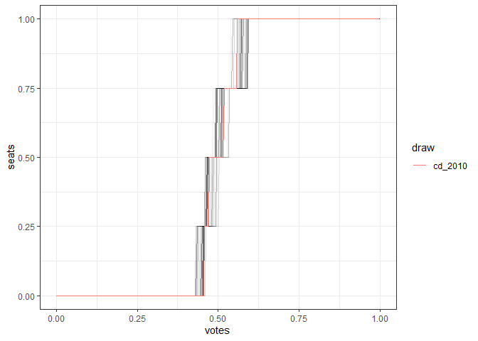

<!-- README.md is generated from README.Rmd. Please edit that file -->

# svc

<!-- badges: start -->

[](https://github.com/christopherkenny/svc/actions/workflows/R-CMD-check.yaml)
<!-- badges: end -->

The goal of `svc` is to build seat

## Installation

You can install the development version of svc from
[GitHub](https://github.com/christopherkenny/svc) with:

``` r
devtools::install_github('christopherkenny/svc')
```

## Example

First we load `svc`

``` r
library(svc)
```

Then, we can use `redist` example Iowa data to get a `redist_plans`
object with a column of Democratic voteshares.

``` r
library(redist)
#> Warning: package 'redist' was built under R version 4.2.1
#> Loading required package: redistmetrics
#> 
#> Attaching package: 'redist'
#> The following object is masked from 'package:stats':
#> 
#>     filter
data(iowa)
ia <- redist_map(iowa, existing_plan = cd_2010, pop_tol = 0.01)
plans <- redist_smc(ia, 100, silent = TRUE)
plans <- plans %>% dplyr::mutate(dvs = group_frac(ia, dem_08, dem_08 + rep_08))
```

Once the data is ready, we can make a Seats-Votes curve.

``` r
svc(plans, dvs)
```


